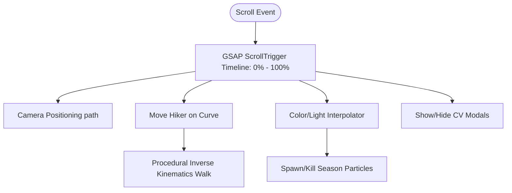

# 🏔️ BẢN THIẾT KẾ KIẾN TRÚC: HÀNH TRÌNH LEO NÚI 4 MÙA (3D SCROLLYTELLING)

> [!TIP]
> Mục tiêu tối thượng của dự án này không chỉ là làm một trang hiển thị CV, mà là kể một câu chuyện (Storytelling) về quá trình trưởng thành và rèn luyện qua góc nhìn Thể Hình / Leo núi điện ảnh. Chúng ta sẽ áp dụng cơ chế cuộn chuột (Scroll) để tua ngược/xuôi dòng thời gian của cả chuyến đi.

---

## 1. TỔNG QUAN HỆ THỐNG (SYSTEM OVERVIEW)

Cốt lõi của dự án sử dụng **Three.js** cho việc Render môi trường 3D thủ công (Procedural Generation) kết hợp với **GSAP ScrollTrigger** để đồng bộ vị trí cuộn chuột với diễn tiến của hoạt ảnh.

## 2. XÂY DỰNG ĐỊA HÌNH VÀ NHÂN VẬT THỦ CÔNG

Thay vì lệ thuộc vào các model `.glb` tải sẵn trên mạng thường bị lỗi UV hoặc quá nặng, ta sẽ dựng hình mọi thứ bằng code thuần.

- **Ngọn Núi (The MountainPath):** Sử dụng `THREE.PlaneGeometry(width, length, segmentsX, segmentsY)`. Duyệt qua tất cả các điểm (Vertices) của mặt phẳng, áp dụng thuật toán **Simplex/Perlin Noise** để dâng các điểm lồi lõm tạo thành vách đá gai góc (High-poly). 
- **Quỹ Đạo Cuộn (The Spine):** Một đường `THREE.CatmullRomCurve3` vô hình uốn lượn chéo góc hướng dần lên đỉnh rặng núi mờ sương. Camera và Nhân Vật sẽ trượt dọc trên Curve này dựa trên % chiều dài khi người dùng cuộn chuột.
- **Nhân Vật (The Hiker):** Lắp ráp bằng nhóm các `BoxGeometry` (Thân, Tay, Chân, Balo, Gậy leo núi). Các khớp xoay qua Pivot point với phương trình tịnh tiến Sine/Cosine để bước đi gập gối tự nhiên khi Camera cuộn tiến lên.

> [!IMPORTANT]
> Hiệu ứng **Hình Chụp Ngược Sáng (Silhouette)** sẽ đạt được bằng cách tắt hệ thống Ambient Light truyền thống. Chỉ dùng 1 nguồn sáng `DirectionalLight` duy nhất bắn ở **sau lưng** ngọn núi đâm về phía người chơi (Backlighting). Vật liệu núi dùng `MeshStandardMaterial` màu sẫm đen/xám sẽ tạo được độ gắt (Contrast) cháy khét lẹt đậm chất Cinematic.

---

## 3. THIẾT KẾ CẢNH QUAN 4 MÙA (4 SEASONS STAGES)

| Chặng (Scroll %) | Mùa & Tuổi trẻ | Tone Màu Lời Kể & Ánh Sáng | Hiệu ứng Thời tiết Hạt (Particle) | Kịch Bản CV Hiện Lên |
| :--- | :--- | :--- | :--- | :--- |
| **0% - 25%** | **Xuân** (Khởi động) | Xanh lơ trong vắt, Vàng chanh. | Cánh hoa đào bay lượn (Pink). | Khởi nguồn / Học tập (Base Camp). |
| **25% - 50%** | **Hạ** (Phấn đấu) | Xanh lá gắt, Nắng trắng chói. | Vạt nắng (God rays), bụi lấp lánh. | Dự án đầu tay khó khăn (Dốc đứng). |
| **50% - 75%** | **Thu** (Nếm trái) | Cam hoàng hôn, Đỏ lãng mạn. | Lá phong đỏ rụng (Orange flakes). | Thành quả lớn lao (Mỏm đá sống ảo). |
| **75% - 100%** | **Đông** (Đỉnh Cao) | Trắng toát tuyết, Xanh dương sẫm. | Bão tuyết ràn rạt đập ngang (White). | Kỹ năng cứng / Level 99 (Chóp băng). |

---

## 4. KẾ HOẠCH PHÁT TRIỂN / TRIỂN KHAI 5 BƯỚC

1. **Phase 1 (Khung CSS & GSAP Scroll):** Thiết lập thẻ `<body>` có chiều cao khổng lồ (VD: `5000px`) để tao ra thanh cuộn. Bọc Canvas thành dạng dính cố định `position: fixed;`. Cài đặt `gsap.timeline` lắng nghe % scroll dọc.
2. **Phase 2 (Đắp Núi 3D Noise):** Thuần tuý xây các thuật toán Đồi Cỏ Mùa Xuân -> Vách Núi Mùa Thu -> Đỉnh Cực tuyết. Lót đèn Backlight tìm Silhouette.
3. **Phase 3 (Tỉa Nhân Vật Chuyển Động):** Gắn Voxel Hiker vào Curve vô tuyến. Code thủ công phương trình di chuyển chân bước / gậy nhấp nhô theo vận tốc lăn của con cuộn chuột. (Chuột lăn nhanh -> Trèo nhanh. Chuột khựng -> Đứng thở).
4. **Phase 4 (Cỗ Máy Thời Tiết):** Cắm Engine Particle sinh hạt liên tục bằng hệ đệm `THREE.Points`. Mix màu dần bằng thuật toán nội suy `.lerpColors()` nếu Camera trượt qua khu ngã rẽ giữa các mùa.
5. **Phase 5 (Phao Gắn HTML):** Chuyển hoá tọa độ 3D của các cột mốc đá trên núi thành 2D vị trí thẻ `
` HTML Float để người xem vừa chiêm ngưỡng kỹ năng đồ hoạ, vừa có thể click xem ảnh Dự Án CV.

> [!CAUTION]
> Dựng High-Poly với Perlin noise trên di động (Mobile) có thể rớt FPS. Trong mã nguồn tôi sẽ cần thiết lập tỷ lệ lưới (Segments) phụ thuộc vào Kích thước Card Đồ Họa của khách truy cập để vừa căng mịn bóng đổ, vừa vẫn lướt mượt 60fps trên Iphone.
